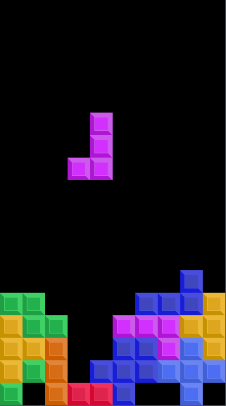
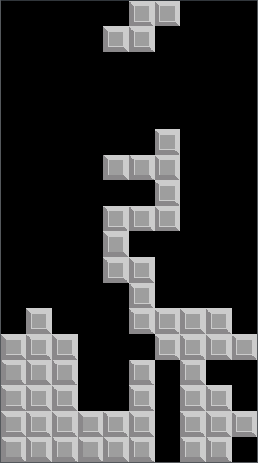
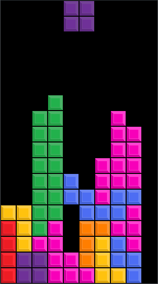
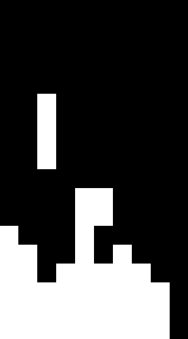
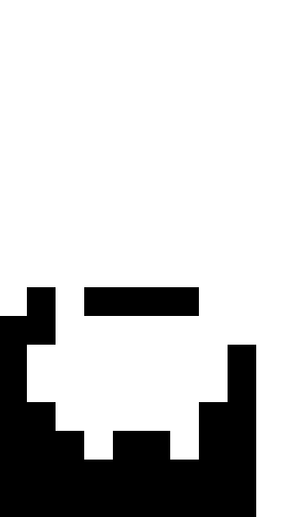

# Tetris
[Tetris](https://en.wikipedia.org/wiki/Tetris) clone made in SFML using C++.

## Installation
```bash
git clone git@github.com:nilsmo1/tetris-sfml.git
make
./tetris
```

## Color schemes
Running the binary with `--color <color scheme>` uses the color schemes in `/assets`. The default color scheme is the same as when running with `--color color`.

`./tetris --color color`



`./tetris --color white`



`./tetris --color tiles`



`./tetris --color minimal`



`./tetris --color light-minimal`


